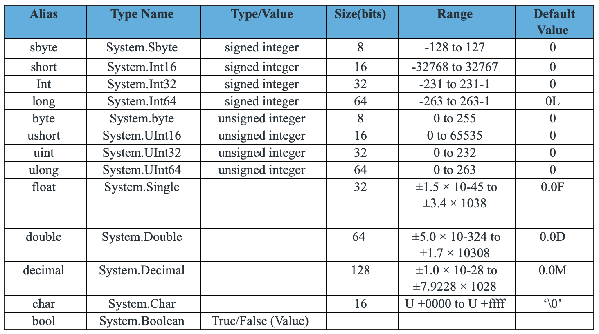
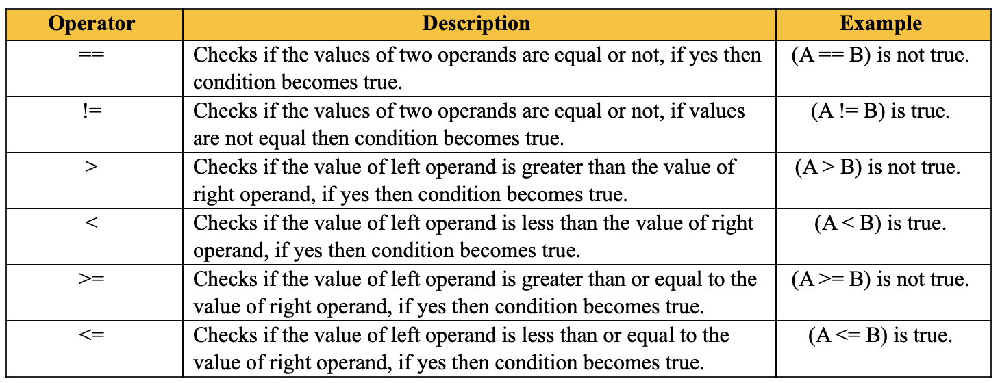
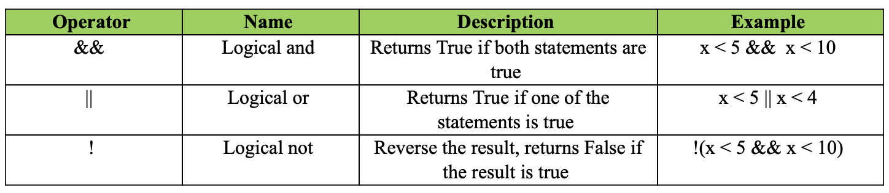
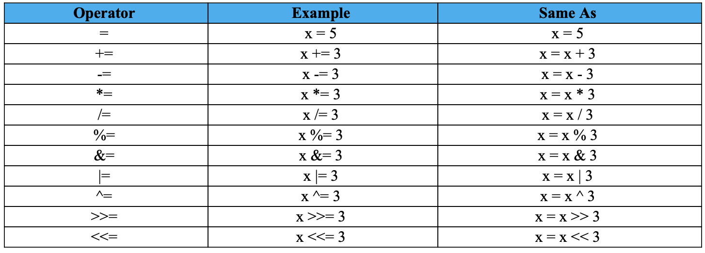

**Team Wood:**

Edale Miguel - Question 1 - 3
Mycole Brown - Question 4 - 6
Jordan Fleming - Question 7 - 8

**Collaborative Wiki 3 - Programming Language Deep Dive**

Questions:

1. Data Types (Chapter 6)
2. Expressions (Chapter 7)
3. Assignment Statements (Chapter 7)
4. Statement-Level Control Structures (Chapter 8)
5. Subprograms (Chapter 9 and 10)
6. Abstract Data Types and Encapsulation Concepts (if there are any) (Chapter 11)
7. Object-Oriented Programming (Chapter 12)
8. Exception Handling and Event Handling (Chapter 14)

# C# 

C# (pronounced "C-sharp") is a modern, versatile programming language developed by Microsoft. It was introduced in the early 2000s as part of the .NET framework. C# is designed to be simple, powerful, and easy to use, making it a popular choice for developing a wide range of applications, from web and mobile apps to desktop software and games.

**Basic Syntax:**
```c#
    using System;
    namespace HelloWorld
    {
        class Program
        {
            static void Main(string[] args)
            {
                Console.WriteLine("Hello, World!");
            }
        }
    }
```
The `using System`; directive imports the System namespace, which includes basic classes like Console. The `namespace keyword` declares a namespace to organize your code. The `class keyword` defines a class named Program. The `Main method` is the entry point of a C# application, and the `Console.WriteLine method` prints "Hello, World!" to the console.

## Data Types

C# programming language encompasses a rich variety of data types, expressions, and assignment statements, each serving a distinct purpose in software development.

Data types in C# are categorized into three primary groups: `Value Data Types`, `Reference Data Types`, and `Pointer Data Types`.  

Value data types directly store variable values in memory and can accommodate both signed and unsigned literals. Signed integral types can handle negative and positive values, while unsigned types solely accommodate positive numbers. Integral types span 8-bit, 16-bit, 32-bit, and 64-bit values. Floating-point types, such as float and double, cater to decimal point values, with float representing 32-bit single-precision and double representing 64-bit double-precision floating point numbers. Additionally, the decimal type is adept at financial calculations, boasting 128-bit precision. Character types represent UTF-16 code units, and boolean types solely accept true or false values. 



Reference data types, in contrast, store memory addresses rather than values directly. Examples include strings, which represent sequences of Unicode characters, and objects, which serve as the base class for all data types in C#.  

Example: 

```c#
    // In this code, dog and dog2 refer to the same object. 
    Animal dog = new Animal(5); 
    Animal dog2 = dog; 
    dog.GrowOlder(); // Method increases Age by 1  
    Console.WriteLine(dog.Age); // 6  
    Console.WriteLine(dog2.Age); // 6
```

Pointers, another category, also store memory addresses. The ampersand (&) symbol serves as the Address Operator, determining the address of a variable, while the asterisk (*) symbol functions as the Indirection Operator, accessing the value stored at an address.

Example:

```c#
    // Get the memory address of the variable 'number' 
    int number = 10; 
    int* ptr = &number;
```

## Expressions

Expressions in C# facilitate computations that yield values. They include Constant Expressions, Variable Expressions, Arithmetic Expressions, Relational Expressions, Logical Expressions, Bitwise Expressions, Assignment Expressions, Method Call Expressions, and Conditional Expressions. Each type of expression serves a specific computational purpose, from simple literal values to complex method calls.

Expressions in C# are combinations of values, variables, operators, and method calls that evaluate to a single value. They represent computations or operations that produce a result. `Constant expressions` are simple values like literals, while `variable expressions` are represented by variables themselves. `Arithmetic expressions` involve arithmetic operations, `relational expressions` are used for comparison, 'logical expressions' involve logical operators, and `bitwise expressions` involve bitwise operators. `Assignment expressions` assign a value to a variable, `method call expressions` involve calling a method, and `conditional expressions` utilize the ternary conditional operator.

Examples:
```c#
    // Constant Expressions
    const double PI = 3.14;
    Console.WriteLine("Value of PI: " + PI);

    // Variable Expressions
    int x = 5;
    int y = 3;

    // Arithmetic Expressions
    int additionResult = x + y;
    Console.WriteLine("Addition Result: " + additionResult);

    int subtractionResult = x - y;
    Console.WriteLine("Subtraction Result: " + subtractionResult);

    int multiplicationResult = x * y;
    Console.WriteLine("Multiplication Result: " + multiplicationResult);

    int divisionResult = x / y;
    Console.WriteLine("Division Result: " + divisionResult);

    // Relational Expressions
    bool isEqual = (x == y);
    Console.WriteLine("Are x and y equal? " + isEqual);

    bool isGreaterThan = (x > y);
    Console.WriteLine("Is x greater than y? " + isGreaterThan);

    // Logical Expressions
    bool logicalAnd = (x > 0 && y > 0);
    Console.WriteLine("Is x and y both greater than 0? " + logicalAnd);

    bool logicalOr = (x > 0 || y > 0);
    Console.WriteLine("Is either x or y greater than 0? " + logicalOr);

    // Bitwise Expressions
    int bitwiseAndResult = x & y;
    Console.WriteLine("Bitwise AND Result: " + bitwiseAndResult);

    int bitwiseOrResult = x | y;
    Console.WriteLine("Bitwise OR Result: " + bitwiseOrResult);

    // Assignment Expressions
    int z;
    z = x + y;
    Console.WriteLine("Value of z after assignment: " + z);

    // Method Call Expressions
    int max = Math.Max(x, y);
    Console.WriteLine("Maximum of x and y: " + max);

    // Conditional Expressions
    string message = (x > y) ? "x is greater than y" : "y is greater than or equal to x";
    Console.WriteLine(message);
```

Understanding and effectively utilizing expressions are crucial for performing calculations, making decisions, and manipulating data within a program.

## Operators

Operators enable developers to perform arithmetic calculations, compare values, combine conditions, manipulate binary data, and assign values to variables efficiently. Operators in C# are symbols or keywords that perform operations on operands. They define how operands are manipulated to produce a result. C# operators can be categorized based on their functionality and the number of operands they take. Functionally, they include Arithmetic Operators, Relational Operators, Logical Operators, Bitwise Operators, Assignment Operators, and the Conditional Operator. Additionally, they are classified based on the number of operands they take, including Unary Operators, Binary Operators, and Ternary Operators. Unary operators take one operand to perform the operation, binary operators take two operands, and the ternary operator takes three operands.

`Arithmetic operators` perform mathematical operations on operands, such as addition, subtraction, multiplication, division, and modulus.


`Relational operators` facilitate comparisons between two values, returning true or false based on equality, inequality, or magnitude.  


`Logical operators` combine or negate conditions, including AND, OR, and NOT operations.  


`Bitwise operators` operate at the bit level, performing operations like AND, OR, XOR, and complement.  


`Assignment operators` assign values to variables, offering shorthand methods for operations like addition, subtraction, and bitwise operations.  


Finally, the `conditional operator` is a ternary operator that returns one of two values based on the evaluation of a Boolean expression.

Syntax:

```c#
    condition ? true_expression : false_expression
```

Example:
```c#
    // Using the conditional operator to check if the number is even or odd
    int number = 10;
    string result = (number % 2 == 0) ? "even" : "odd"
    Console.WriteLine($"The number {number} is {result}.");
```

Understanding these fundamental concepts is crucial for proficient  development in C# and lays the foundation for creating robust and efficient software solutions.

A thorough understanding of statement-level control structures, subprograms, abstract data types, and encapsulation is essential for mastering C#.

## Statement-Level Control Structures
In C#, statement-level control structures are the backbone of any program, because they guide the flow of execution based on certain conditions and loops. Conditional statements like if, else if, else, and switch help in making decisions within the code. The if statement checks a condition and executes a block of code if that condition is true. For more complex scenarios, else if and else extend this logic. The switch statement simplifies the process of evaluating a single variable against many possible values, offering a cleaner alternative to multiple if-else statements.

Loops are another crucial control structure in C#. The for loop is used when the number of iterations is known ahead of time. On the other hand, the while loop continues to execute as long as its condition remains true, which is useful when the number of iterations isn't predetermined. The do-while loop makes sure that the code block runs at least once before checking the condition. The foreach loop is specifically designed for iterating over collections, making it straightforward to access each element in an array or list.

These control structures make C# a flexible and powerful language, and help it to handle various programming tasks efficiently.

## Subprograms
Subprograms, methods, functions, are essential components of C# that allow for modular and reusable code. A method in C# is a block of code designed to perform a specific task. Methods help break down complex problems into smaller, manageable parts, promoting code reuse and maintainability. Each and every method has a name, a return type, and a set of parameters. The return type tells us the type of value the method returns, and void means it doesn't return any value. Parameters allow methods to accept input values, enabling them to perform operations based on those inputs.

C# is fine with method overloading, which allows multiple methods to have the same name but different parameter lists. This feature enhances flexibility and readability, allowing methods to handle various types of inputs without requiring different names.

Anonymous methods and lambda expressions are also supported in C#. These features allow for the definition of inline methods, which are super useful with delegates and events, where concise method definitions are needed.

Subprograms in C# improve code organization and readability, making it easier to test and debug by isolating specific tasks within methods.

## Abstract Data Types and Encapsulation
Abstract data types (ADTs) and encapsulation are key principles of object-oriented programming (OOP) in C#. An abstract data type is a model for a certain kind of data structure that specifies the type of data stored, the operations that can be performed, and the constraints on those operations. In C#, ADTs are implemented using classes and interfaces. A class defines the data and behavior of an object, while an interface is specifically a contract that classes can implement.

Encapsulation involves bundling data (fields) and methods (functions) that operate on the data into a single unit, or class, and restricting access to some of the object's components. This is achieved through access modifiers like public, private, protected, and internal, which control the visibility of class members. Encapsulation helps protect the internal state of an object and prevents external interference.

Properties in C# support encapsulation by providing a way to read and write the values of private fields through public methods. Properties allow controlled access to the fields, a lot of the time including validation logic that's inside of get and set accessors.

Inheritance and polymorphism are also really integral to C#'s way of having ADTs and encapsulation. Inheritance allows a class to inherit members from a base class, promoting code reuse and creating a hierarchical relationship. Polymorphism lets methods operate differently based on the object that invokes them, allowing for more flexible and dynamic code.

These concepts are crucial and fundamental to building complex software systems that are hardy and easy to manage.
C# is a really powerful and versatile programming language, has many great features for developing a wide range of applications. Its statement-level control structures give us precise control over program flow, while subprograms give us modular and reusable code. Abstract data types and encapsulation concepts are central to C#'s object-oriented approach, promoting well-structured and maintainable software. Understanding and effectively using these aspects of C# is essential for any programmer looking to use the full suite of this language's abilities.


## OOP in C#

C# fully embraces object-oriented programming (OOP) concepts. OOP is a programming paradigm that allows you to model real-world entities and their interactions using classes, objects, inheritance, polymorphism, encapsulation, and abstraction. This approach promotes code reusability, maintainability, and modularity.

### Core Principles of OOP

`Classes` act as blueprints or templates that define the properties (attributes) and methods (functions) that objects of that class will possess. You can create custom classes to represent specific entities in your program. `Objects` are instances of a class. They hold the actual data (property values) and carry out the defined behaviors (methods) associated with the class. Imagine objects as individual entities based on the class template. `Inheritance` allows you to create new classes (derived classes) that inherit properties and methods from existing classes (base classes). This promotes code reuse and enables the creation of class hierarchies with specialized functionalities. `Polymorphism` allows objects of different classes to respond differently to the same method call. This flexibility enables you to write generic code that can work with various object types without modifying the core logic. `Encapsulation` promotes data protection by bundling properties and methods within a class. You can control access to these elements using access modifiers (public, private, protected) to ensure data integrity and prevent unintended modifications. `Abstraction` focuses on exposing essential functionalities while hiding implementation details. This allows you to create user-friendly interfaces that define what objects can do without revealing the underlying complexities of how they achieve it.
### Benefits of Using OOP

**Code Reusability:** By creating reusable classes and leveraging inheritance, you can avoid writing repetitive code and promote code maintainability.

**Modularity:** OOP promotes breaking down complex problems into smaller, manageable modules (classes) with well-defined responsibilities.

**Maintainability:** Code becomes easier to understand, modify, and debug due to modularity and clear separation of concerns within classes.

**Real-World Modeling:** OOP allows you to model real-world entities and their relationships, making the code more intuitive and easier to reason about.

Getting Started with OOP in C#

Here's a basic example to illustrate OOP concepts in C#:

```C#
public class Car  // Define a class named Car
{
    public string Model { get; set; }  // Property of a car, the model, to be a string.
    public int Year { get; set; }       // Property of a car, the year it was made, to be an int

    public void StartEngine()          // Method to start the engine
    {
        Console.WriteLine("Engine started!");
    }
}

public class Program
{
    public static void Main(string[] args)
    {
        Car myCar = new Car();        // Create an object (instance) of Car class
        myCar.Model = "Toyota Camry";  // Set the Model property
        myCar.Year = 2023;             // Set the Year property

        myCar.StartEngine();          // Call the StartEngine method on the object
    }
}
```

In this example:

    * The Car class defines the blueprint for car objects with properties like Model and Year, and a method StartEngine.

    * The Program class creates an object named myCar of type Car and sets its properties.

    * The program then calls the StartEngine method on the myCar object, demonstrating how objects interact with their methods.

    * By understanding and applying OOP principles in C#, you can develop robust, maintainable, and scalable applications.

C# provides a robust set of features for object-oriented programming, making it a powerful language for building scalable and maintainable applications. By leveraging classes, encapsulation, inheritance, polymorphism, and abstraction, developers can create well-structured and efficient code. C# also comes equipped with a large set of exception and event handling tools.

## Event and Exception Handling in C#

C# provides robust mechanisms for handling errors and unexpected situations (exception handling) and coordinating communication between objects (event handling). These features are essential for building well-structured and responsive applications.

### Exception Handling

Exception handling allows you to gracefully manage errors that might occur during program execution. It involves defining how the program should respond to exceptions and potentially recover from them.

When an error or unexpected condition arises, you can explicitly throw an exception using the throw keyword. Exceptions are objects that inherit from the base class Exception. You can create custom exception classes to provide more specific information about the error.

You can use try...catch blocks to capture exceptions thrown within the try block. The catch block defines the code to execute if a specific type of exception (or any exception if using catch (Exception ex)) is thrown.

The finally block (optional) is always executed after the try and catch blocks (if any), regardless of whether an exception is thrown. This is useful for releasing resources or performing cleanup tasks.

Here's an example of exception handling:

```C#
try
{
  // Code that "might" throw an exception
  int result = Divide(10, 0); // Attempt to divide by zero, ruh roh.
}
catch (DivideByZeroException ex)
{
  Console.WriteLine("Error: Division by zero!");
  Console.WriteLine(ex.Message); // Message for the exception to output.
}
finally
{
  // Close files, release resources (always executed). Optional block
}

// Helper method to divide ints.
int Divide(int a, int b)
{
  return a / b;
}
```

In this example:

The try block attempts to divide 10 by 0, which will throw a DivideByZeroException.
The catch block catches this specific exception type and displays an error message.
The finally block (if included) would execute even if an exception is thrown. Remember this block is optional.

### Event Handling

Event handling is a powerful mechanism for communication between objects, allowing objects to notify other objects (subscribers or listeners) when specific events occur. This promotes loose coupling and modularity in your code.`Events` are special member declarations within a class that signal the occurrence of an event, typically following the naming convention EventName (e.g., ButtonClicked). `Delegates` are object references that point to methods capable of handling an event, with delegate types defined to specify the signature (parameters and return type) of methods that can subscribe to an event. Methods that subscribe to an event and are invoked when the event is raised are called `event handlers`, which typically receive information about the event through arguments passed by the publisher (the object raising the event). When an event occurs within an object, it raises the event by invoking the delegate associated with the event, triggering the execution of all subscribed event handlers.

Here's another example this time of event handling:

```C#
public class Button
{
  public delegate void ClickedEventHandler(object sender, EventArgs e);
  public event ClickedEventHandler Clicked;

  public void OnClick()
  {
    Clicked?.Invoke(this, EventArgs.Empty);
  }
}

public class Form
{
  public Form()
  {
    Button myButton = new Button();
    myButton.Clicked += ButtonClicked;
  }
  private void ButtonClicked(object sender, EventArgs e)
  {
    Console.WriteLine("Button clicked!");
  }
}
```

In the above example:

The Button class defines a Clicked event and a ClickedEventHandler delegate to specify the method signature for event handlers. The OnClick method raises the Clicked event by invoking the Clicked delegate. The Form class creates a Button object and subscribes to its Clicked event using the += operator. When the button is clicked (simulated in OnClick), the ButtonClicked event handler defined in the Form class is executed. By effectively utilizing exception handling and event handling, you can build more robust, maintainable, and responsive C# applications. These mechanisms enable you to manage errors gracefully, coordinate communication between objects, and create loosely coupled and modular systems.

C# is a powerful and flexible language suitable for a wide variety of programming tasks. Whether you're building web applications, desktop software, or games, C# provides the tools and features to help you create robust and efficient applications. By learning C#, you'll gain a valuable skill that is in high demand in the software development industry.


